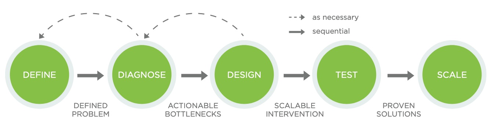

# 1.4 Experiments in your project

Where do experiments fit in the broader lifecycle of a behavioural project?

One conception comes from ideas42's [behavioural design process](https://www.ideas42.org/wp-content/uploads/2018/04/BDT_Playbook_FINAL-digital.pdf). They describe a five stage process:

**Define** the problem and try to remove any embedded assumptions about why it may be occurring.
**Diagnose** what behavioral  bottlenecks  may  be  driving  the  problem.
**Design**  interventions  that  directly  address the key bottlenecks we’ve diagnosed.
**Test** the intevention to see whether the design successfully addresses the problem, typically using a randomised controlled trial.
**Scale** the solution to a larger population or adapt it to other contexts if an intervention proves effective.

## References

Barrows et al (2018) *Behavioral Design Teams: A Model for Integrating Behavioral Design in City Government*, ideas42, https://www.ideas42.org/wp-content/uploads/2018/04/BDT_Playbook_FINAL-digital.pdf