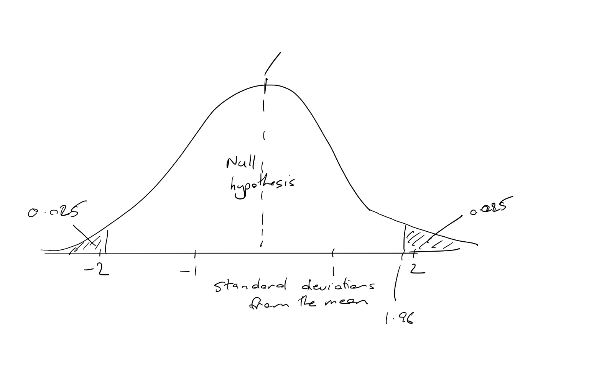

# 3.5 Statistical significance and p-values

A commonly used decision rule used in frequentist frameworks is "statistical significance". The null hypothesis is rejected (or the two hypotheses distinguished) if the result of the test is "statistically significant".

An experiment will typically have a defined significance level, denoted by $\alpha$, which is the probability that the experiment will reject the null hypothesis under the assumption that the null hypothesis is true.

$\alpha$ is commonly set at 0.05. This means that 5% of the time the experiment will reject the null hypothesis - the hypothesis that there is no effect - even if there is actually no effect.

## Testing for statistical significance

Let us return to our example of sending a letter to taxpayers to get them to submit their tax returns on time. 76% of people in the control group submitted on time, compared to 79% in the intervention group. There was a 3 percentage point difference between the two groups.

You know that your estimate of the mean effect will vary by chance each time you measure it. The question you have is whether this mean effect of 3 percentage points represents a difference in the effectiveness of the treatments or just random variation in your measurements.

To answer this, you calculate a "test statistic". A test statistic summarises the deviation of the data from what you would expect if the null hypothesis is true.

A commonly used test statistic in randomised controlled trials is the Z-score. The Z-score is a measure of how many standard deviations the effect size of the intervention is above or below zero. In our example, this is the difference in the two means divided by the standard error of that difference.

It is calculated as follows:

$Z=\frac{|\bar{x}_1-\bar{x}_0|}{s_{\bar{x}}}$

This Z-score is then compared against the normal distribution to see whether the Z-score exceeds the **critical value**.

The critical value is effectively defined by $\alpha$. It is the point on the distribution at which the areas of the distribution exceeding the (absolute value of the) critical value equal $\alpha$. There should be only a probability of $\alpha$ that this critical value would be exceeded under the assumption that the null hypothesis is true.

The following diagram illustrates the critical value for $\alpha$. The critical value for $\alpha$ = 0.05 is 1.96. The shaded area is 5% of the area under the curve.

As a technical note, if you know the standard deviation in the underlying population, you use a normal distribution. If you don't know the standard distribution in the underlying population, you use Student's t-distribution. If the sample size is large, the t-distribution approximates the normal distribution. It is normally better practice to use the t-distribution, but it's also good practice to use a sample size large enough that the difference between the normal and t-distribution are negligible. This is why when reading experiments you will often read about t-scores and t-tests.

## What is a p-value?

Statistical significance is often communicated using the concept of a p-value. P-values are one of the most widely used and poorly understood concepts in statistics.

A p-value is the probability of obtaining experimental data at least as extreme as the data actually observed, on the assumption that the null hypothesis is correct. A low p-value means that you would have been unlikely to observe those data if the null hypothesis was true.

Importantly, the p-value is not the probability that the null hypothesis is false. I will tease this out further toward the end of this week's material, but you can see that the probability of A given B is different to the probability of B given A.

A p-value is calculated by asking, given the test statistic that we have calculated, what the lowest possible level of $\alpha$ is for which we would still reject the null hypothesis. This means that if the p-value is below $\alpha$ (typically 0.05) we reject the null hypothesis.

## Confidence intervals

Another way of testing for statistical significance is to construct a confidence interval around the parameter in question. If $\alpha$=0.05, a 95% confidence interval (1-$\alpha$) that excludes zero will lead you to reject the null hypothesis.

## A final note

There are a lot of complications and permutations on the above approaches whereby assumptions are tweaked, the variables are continuous or discrete, we use different probability distributions and so on. This flows through to the approach and formulas. As a result, don't spend any effort trying to memorise the particular formulas and don't take this as the definitive approach. Rather, understand the intuition behind what we are trying to do, as that intuition is common across most approaches.

## Watch

The following video summarises some of material over the previous two weeks.

https://youtu.be/eGRd8jBdNYg