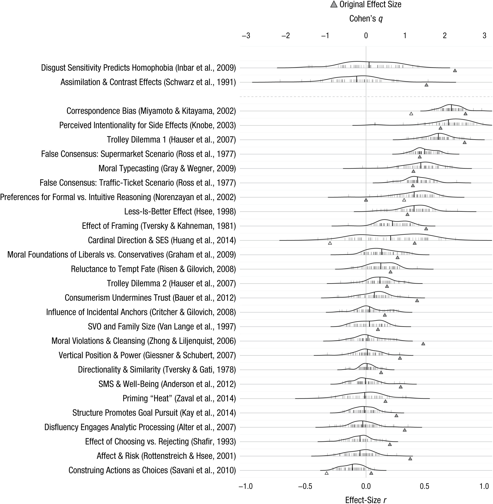

# 6.5 Heterogeneity

Experimental treatments can have different effects on different people.

In most randomised controlled trials, however, there is a focus on *average treatment effects*. This is partly a legacy of the sample sizes we use. Partition into smaller groups requires a larger total sample size for accurate inference.

There is considerable benefit in considering heterogeneity in experiments. It can provide insight into how the intervention can be targeted to those who will benefit most, how the treatment works, or how the treatment can be improved.

As one illustration, Costa and Kahn (2013) examined how people's change in energy use in response to a home energy report (of the type we looked at in week 2 [ADD LINK]) varied with their political ideology. Their analysis is summarised in the following chart.

Knowledge of the political leanings of the recipients of the energy report could help targeting the reports and influence their design. It might also provide fodder to develop further hypotheses to make them more effective.

# Heterogeneity across cultures

On way in which heterogeneity shows itself is across cultures. The artefactual field trial we examined in Week 1, where Joe Henrich and friends played the ultimatum game in small scale societies, demonstrates this.

However, there is also a commonality across cultures. In the Many Labs 2 study, researchers performed replications of various findings in behavioural science across a range of different countries and cultures. A core theme of the result was that the same studies tended to replicate across countries and cultures, or tended to fail everywhere.

One important implication of this is that, contrary to some claims, heterogeneity of study participants is unlikely to be an explanation for the replication crisis.

# Optional reading

Yong (2018) "Psychology’s Replication Crisis Is Running Out of Excuses", *The Atlantic*, https://www.theatlantic.com/science/archive/2018/11/psychologys-replication-crisis-real/576223/

## References

Costa and Kahn (2013) "Energy Conservation "Nudges" and Environmentalist Ideology: Evidence from a Randomized Residential Electricity Field Experiment", *Journal of the European Economic Association*, 11(3), 680-702, https://doi.org/10.1111/jeea.12011

Henrich et al (2001) "In Search of Homo Economicus: Behavioral Experiments in 15 Small-Scale Societies", *American Economic Review Papers and Proceedings*, 91(2), 73-78, https://doi.org/10.1257/aer.91.2.73

Klein et al (2018) "Many Labs 2: Investigating Variation in Replicability Across Samples and Settings", *Advances in Methods and Practices in Psychological Science*, 1(4), 443-490, https://doi.org/10.1177/2515245918810225

